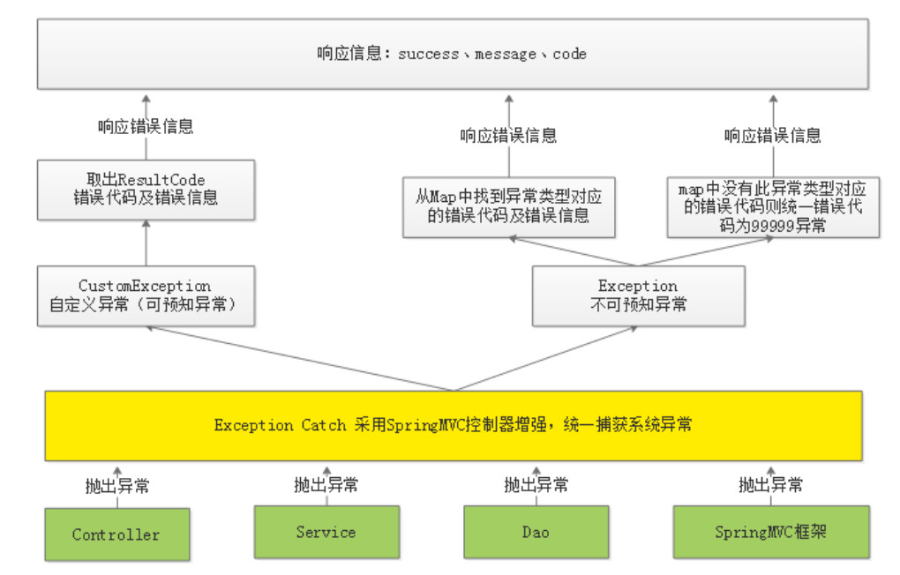

# 异常处理

## 1 异常处理的问题分析

```java
if (cmsPage1 == null) {
    //调用dao新增页面
    cmsPage.setPageId(null);
    cmsPageRepository.save(cmsPage);
    return new CmsPageResult(CommonCode.SUCCESS, cmsPage);
    }
    //添加失败
    return new CmsPageResult(CommonCode.FAIL, null);
```

1. 上边的代码只要操作不成功仅向用户返回 “错误代码：11111，失败信息：操作失败”，**无法区别具体的错误信**
   **息**。
2. service方法在执行过程出现异常在哪捕获？在service中需要都加try/catch，如果在controller也需要添加
   try/catch，**代码冗余严重且不易维护**。 

## 2 异常问题解决方案

1. 在Service方法中的编码顺序是先校验判断，有问题则抛出具体的异常信息，最后执行具体的业务操作，返回成功信息。

2. 在统一异常处理类中去捕获异常，无需controller捕获异常，向用户返回统一规范的响应信息。

   代码模板：

   ```java
   //添加页面
   public CmsPageResult add(CmsPage cmsPage){
       //校验cmsPage是否为空
       if(cmsPage == null){
       //抛出异常，非法请求
       //...
       }
       
       //根据页面名称查询（页面名称已在mongodb创建了唯一索引）
       CmsPage cmsPage1 = cmsPageRepository.
                          findByPageNameAndSiteIdAndPageWebPath(cmsPage.getPageName(),
                          cmsPage.getSiteId(), cmsPage.getPageWebPath());
       //校验页面是否存在，已存在则抛出异常
       if(cmsPage1 !=null){
       //抛出异常，已存在相同的页面名称
       //...
       } 
       
       cmsPage.setPageId(null);//添加页面主键由spring data 自动生成
       CmsPage save = cmsPageRepository.save(cmsPage);
       //返回结果
       CmsPageResult cmsPageResult = new CmsPageResult(CommonCode.SUCCESS,save);
       return cmsPageResult;
   }
   ```

## 3 异常处理流程 

系统对异常的处理使用统一的异常处理流程：

1. 自定义异常类型；
2. 自定义错误代码及错误信息；
3. 对于可预知的异常由程序员在代码中主动抛出，由SpringMVC统一捕获：
           可预知异常是程序员在代码中手动抛出本系统定义的特定异常类型，由于是程序员抛出的异常，通常异常信息比较齐全，程序员在抛出时会指定错误代码及错误信息，获取异常信息也比较方便。
4. 对于不可预知的异常（运行时异常）由SpringMVC统一捕获Exception类型的异常：
           不可预知异常通常是由于系统出现bug、或一些不要抗拒的错误（比如网络中断、服务器宕机等），异常类型为RuntimeException类型（运行时异常）。
5. 可预知的异常及不可预知的运行时异常最终会采用统一的信息格式（错误代码+错误信息）来表示，最终也会随请求响应给客户端。 

<div align= center>
    
</div>

## 4 可预知异常处理 

### 4.1 自定义异常类 

#### 4.1.1 在common工程定义异常类型:

```java
/**
 * 自定义异常类型
 */
public class CustomException extends RuntimeException {

    //错误代码
    ResultCode resultCode;

    public CustomException(ResultCode resultCode) {
        this.resultCode = resultCode;
    }

    public ResultCode getResultCode() {
        return resultCode;
    }

}
```

#### 4.1.2 响应代码类

```java
/**
 * 10000-- 通用错误代码
 * 22000-- 媒资错误代码
 * 23000-- 用户中心错误代码
 * 24000-- cms错误代码
 * 25000-- 文件系统
 */
public interface ResultCode {

    //操作是否成功,true为成功，false操作失败
    boolean success();
    //操作代码
    int code();
    //提示信息
    String message();
}
```

#### 4.1.3 异常抛出类 

```java
public class ExceptionCast {

    public static void cast(ResultCode resultCode) {
        throw new CustomException(resultCode);
    }
}
```

#### 4.1.4 异常捕获类 

```java
@ControllerAdvice
public class ExceptionCatch {
    private static final Logger LOGGER = LoggerFactory.getLogger(ExceptionCatch.class);

    // 捕获 CustomException异常
    @ExceptionHandler(CustomException.class)
    // 返回json格式数据,不添加该注解会找不到原路径
    @ResponseBody
    public ResponseResult customException(CustomException e) {
        LOGGER.error("catch exception : {}\r\n ", e.getMessage(), e);
        ResultCode resultCode = e.getResultCode();
        ResponseResult responseResult = new ResponseResult(resultCode);
        return responseResult;
    }
}
```

#### 4.1.5 定义错误代码

```
@ToString
public enum CmsCode implements ResultCode {
    CMS_ADDPAGE_EXISTSNAME(false, 24001, "页面名称已存在！"),
    CMS_GENERATEHTML_DATAURLISNULL(false, 24002, "从页面信息中找不到获取数据的url！"),
    CMS_GENERATEHTML_DATAISNULL(false, 24003, "根据页面的数据url获取不到数据！"),
    CMS_GENERATEHTML_TEMPLATEISNULL(false, 24004, "页面模板为空！"),
    CMS_GENERATEHTML_HTMLISNULL(false, 24005, "生成的静态html为空！"),
    CMS_GENERATEHTML_SAVEHTMLERROR(false, 24005, "保存静态html出错！"),
    CMS_COURSE_PERVIEWISNULL(false, 24007, "预览页面为空！");
    //操作代码
    boolean success;
    //操作代码
    int code;
    //提示信息
    String message;

    private CmsCode(boolean success, int code, String message) {
        this.success = success;
        this.code = code;
        this.message = message;
    }
```

### 4.2 修改service

```java
    //新增页面
    public CmsPageResult add(CmsPage cmsPage) {
        if (cmsPage == null) {
            // 页面提交信息为空
            //ExceptionCast.cast(CmsCode.CMS_PAGE_ISNULL);
        }

        //校验页面名称、站点Id、页面webpath的唯一性
        //根据页面名称、站点Id、页面webpath去cms_page集合，如果查到说明此页面已经存在，如果查询不到再继续添加
        CmsPage cmsPage1 = cmsPageRepository.findByPageNameAndSiteIdAndPageWebPath(cmsPage.getPageName(), cmsPage.getSiteId(), cmsPage.getPageWebPath());
        if (cmsPage1 != null) {
            // 页面已经存在,抛出异常
            // 异常内容即为:页面已存在
            ExceptionCast.cast(CmsCode.CMS_ADDPAGE_EXISTSNAME);
        }

        //调用dao新增页面
        cmsPage.setPageId(null);
        cmsPageRepository.save(cmsPage);
        return new CmsPageResult(CommonCode.SUCCESS, cmsPage);
    }
```

### 4.3 测试结果

```
{
  "success": false,
  "code": 24001,
  "message": "页面名称已存在！"
}
```

## 5 不可预知异常处理

​        通常是由框架或第三方组件抛出的；不知道具体的异常信息。我们可以提前在map中配置一些常见异常。当我们捕捉到异常后，先判断是否配置，有点话就抛出对应异常信息，没有的话就抛出‘’系统异常信息“。

### 5.1 异常抛出测试

使用postman测试添加页面，不输入cmsPost信息，提交，报错信息如下 ：

```
org.springframework.http.converter.HttpMessageNotReadableException
此异常是springMVC在进行参数转换时报的错误。
```

上边的响应信息在客户端是无法解析的。

### 5.2 异常捕获类中新增需捕获的异常

1. 在异常捕获类中添加对Exception异常的捕获 ：

   ```java
     // 捕获Exception此类异常
       @ExceptionHandler(Exception.class)
       @ResponseBody
       public ResponseResult exception(Exception exception) {
           // 记录日志
           LOGGER.error("catch exception:{}", exception.getMessage());
           // 暂时返回null
           return null;
       }
   ```

2. 在通用错误代码类CommCode中配置非法参数异常

   ```java
   INVALID_PARAM(false,10003,"非法参数！"),
   ```

3. 在map中配置HttpMessageNotReadableException和错误代码

   ```java
   //定义map，配置异常类型所对应的错误代码
   //使用EXCEPTIONS存放异常类型和错误代码的映射，ImmutableMap的特点的一旦创建不可改变，并且线程安全
   private static ImmutableMap<Class<? extends Throwable>, ResultCode> EXCEPTIONS;
   //定义map的builder对象，去构建ImmutableMap
   protected static ImmutableMap.Builder<Class<? extends Throwable>, ResultCode> builder = ImmutableMap.builder();
   ```

   ```java
    static {
       //定义异常类型所对应的错误代码
       builder.put(HttpMessageNotReadableException.class, CommonCode.INVALID_PARAM);
   }
   ```

4. 在异常捕获类中对Exception异常进行捕获，并从map中获取异常类型对应的错误代码，如果存在错误代码则返回此错误，否则统一返回99999错误

   ```java
   //捕获Exception此类异常
   @ExceptionHandler(Exception.class)
   @ResponseBody
   public ResponseResult exception(Exception exception) {
       //记录日志
       LOGGER.error("catch exception:{}", exception.getMessage());
       
       if (EXCEPTIONS == null) {
               EXCEPTIONS = builder.build(); //EXCEPTIONS构建成功
        }
        //从EXCEPTIONS中找异常类型所对应的错误代码，如果找到了将错误代码响应给用户，如果找不到给用户响应99999异常
       ResultCode resultCode = EXCEPTIONS.get(exception.getClass());
       if (resultCode != null) {
           return new ResponseResult(resultCode);
        } else {
            //返回99999异常
           return new ResponseResult(CommonCode.SERVER_ERROR);
           }
   }
   ```